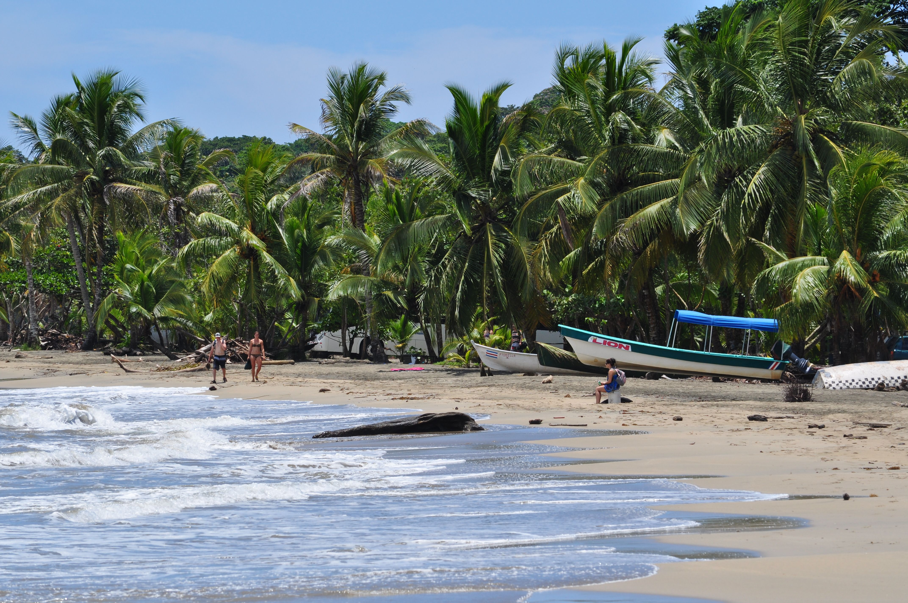
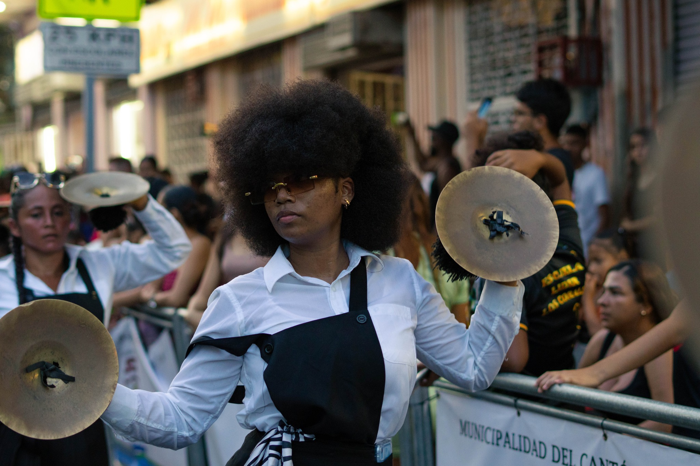
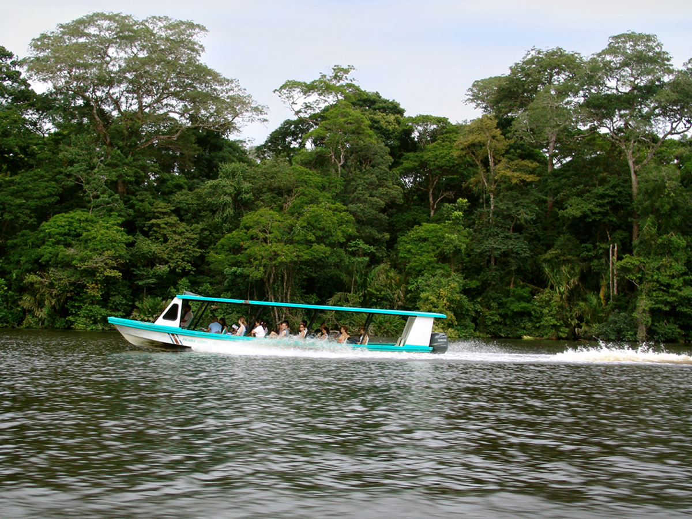

<div align="center">
  
  
  <br />

  <h1>🌴 Limón: Realidad, Cultura y Sabor 🌴</h1>

  <p align="center">
    <strong>Una experiencia inmersiva a través de la historia, la arquitectura y la esencia del Caribe costarricense.</strong>
  </p>

  <p align="center">
    
    
    
    
  </p>
</div>

---

## 📖 Sobre el Proyecto

**Limón: Realidad y Esencia** es una plataforma digital diseñada para redescubrir la provincia de Limón, Costa Rica, mostrándola tal cual es. Lejos de los clichés turísticos convencionales, este proyecto busca retratar la historia viva de la zona, resaltando su rica herencia afro-caribeña, su biodiversidad única y su arquitectura patrimonial.

Con un enfoque **auténtico y profesional**, la página utiliza animaciones fluidas y un diseño visual impactante para guiar al usuario a través de un viaje sensorial por el Caribe.

---

## ✨ Características Principales

### 🏛️ Historia y Arquitectura

Explora el legado arquitectónico de Limón, desde sus edificios históricos hasta la influencia de la época bananera que forjó la identidad de la ciudad.

### 🎭 Cultura y Vida Local

Sumérgete en el ritmo del calipso, las festividades tradicionales y la calidez de su gente. Conoce a figuras icónicas como Walter Ferguson.

### 🌿 Naturaleza Exuberante

Desde los canales de Tortuguero hasta los arrecifes de Cahuita. Una sección dedicada a la biodiversidad que hace de Limón un lugar único en el mundo.

### 🍲 Gastronomía (El Sabor del Caribe)

Un recorrido visual por el Rice and Beans, el Rondón, el Pan Bon y otras delicias que definen la identidad culinaria limonense.

---

## 📸 Galería Visual

<table align="center">
  <tr>
    <td width="33%"></td>
    <td width="33%"></td>
    <td width="33%"></td>
  </tr>
  <tr align="center">
    <td><b>Cultura Viva</b></td>
    <td><b>Naturaleza Pura</b></td>
    <td><b>Sabor Auténtico</b></td>
  </tr>
</table>

---

## 🛠️ Stack Tecnológico

El proyecto está construido con herramientas de vanguardia para garantizar rendimiento y una experiencia de usuario excepcional:

- **Framework:** [Next.js 16 (App Router)](https://nextjs.org/)
- **Lenguaje:** [TypeScript](https://www.typescriptlang.org/)
- **Estilos:** [Tailwind CSS](https://tailwindcss.com/)
- **Animaciones:** [Framer Motion](https://www.framer.com/motion/)
- **Componentes UI:** Shadcn/UI & Magic UI
- **Mapas:** [React Leaflet](https://react-leaflet.js.org/)
- **Iconos:** [Lucide React](https://lucide.dev/)

---

## 🚀 Instalación y Desarrollo

Sigue estos pasos para ejecutar el proyecto localmente:

1. **Clona el repositorio:**

   ```bash
   git clone https://github.com/tu-usuario/landing-puerto-limon.git
   ```

2. **Instala las dependencias:**

   ```bash
   npm install
   ```

3. **Inicia el servidor de desarrollo:**

   ```bash
   npm run dev
   ```

4. **Abre en tu navegador:**
   Visita `http://localhost:3000` para ver el resultado.

---

## 🎨 Diseño y Estética

El diseño se basa en una paleta de colores inspirada en Limón:

- 🟢 **Verde Selva:** Representando la biodiversidad.
- 🟡 **Amarillo Caribe:** Reflejando la energía y el sol.
- 🔵 **Azul Profundo:** Inspirado en el Mar Caribe.
- ⚫ **Modo Oscuro:** Para un toque moderno, profesional y envolvente.

---

<div align="center">
  <p>Hecho con ❤️ para Puerto Limón, Costa Rica</p>
  
</div>
