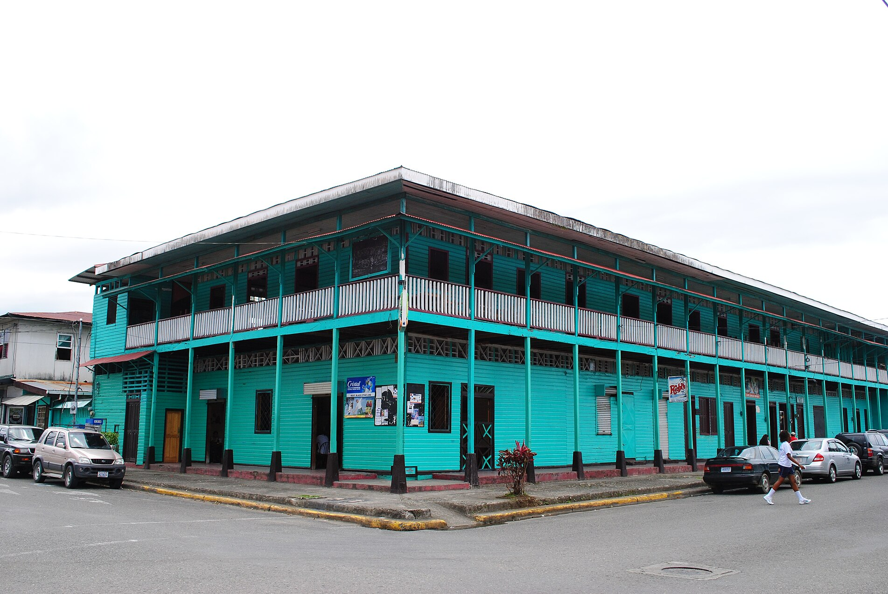
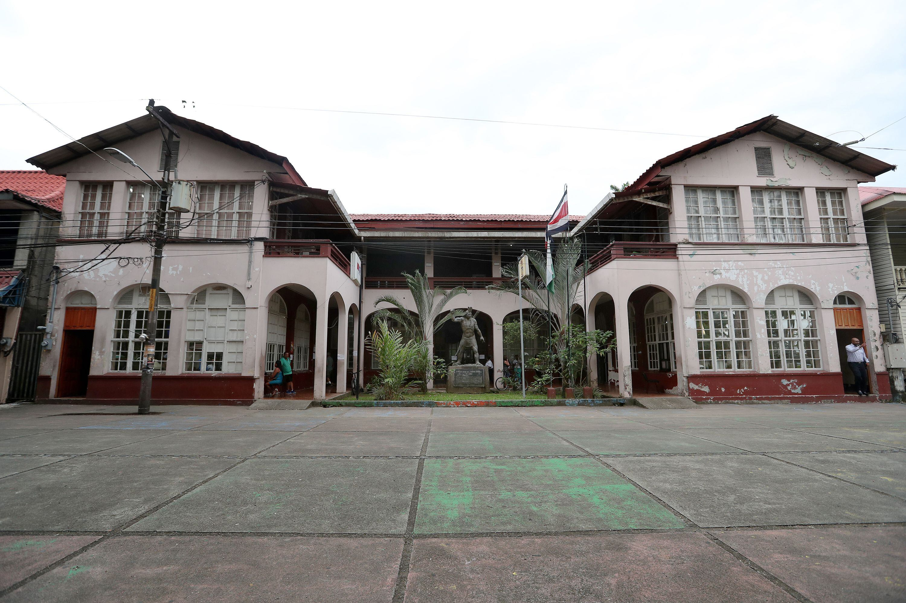
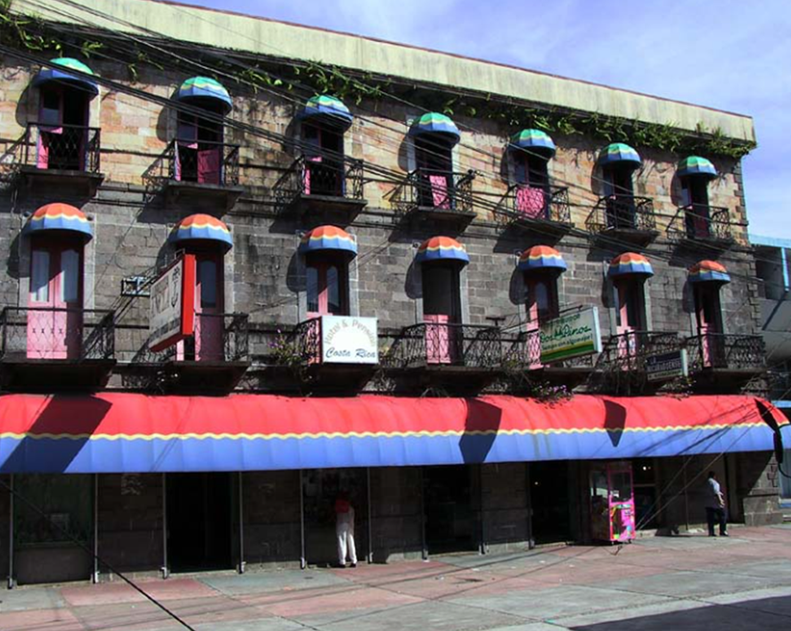
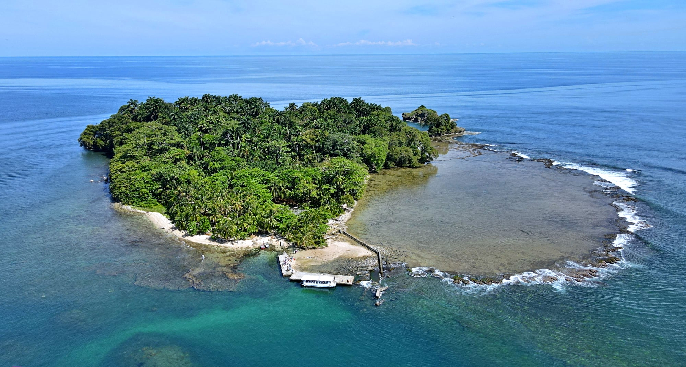
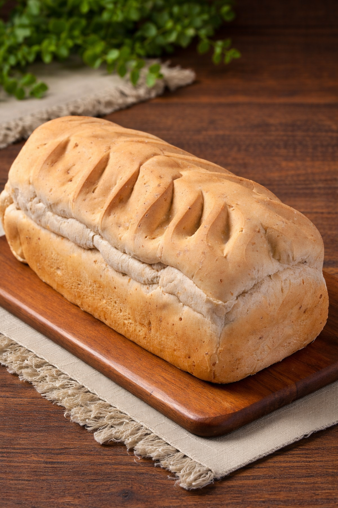

<div align="center">
  
  
  <br /><br />

  <h1>Limón · Realidad y Esencia</h1>

  <p align="center">
    <strong>Una inmersión profunda en la historia, arquitectura y biodiversidad del Caribe costarricense.</strong>
  </p>

  <p align="center">
    
    
    
    
  </p>
</div>

---

### Perfil del Proyecto

**Limón: Realidad y Esencia** es una plataforma digital que retrata la provincia de Limón desde una perspectiva auténtica. El objetivo es documentar la riqueza cultural y natural sin caer en estereotipos, exponiendo la realidad de su patrimonio y su gente.

Esta plataforma sirve como un archivo vivo y una guía interactiva para entender la complejidad y belleza de la región caribeña de Costa Rica.

---

### Inmersión por Secciones

#### 🏛️ Historia y Arquitectura Patrimonio

Esta sección analiza el legado arquitectónico que define el paisaje urbano de Limón. Desde la influencia de la _United Fruit Company_ hasta los edificios de madera de estilo caribeño victoriano que resisten el paso del tiempo.

- **Puntos Clave**: Black Star Line, Palacio Municipal, y la evolución del ferrocarril.
- **Interactividad**: Mapas detallados y cronologías históricas.

<table align="center">
  <tr>
    <td width="33%"></td>
    <td width="33%"></td>
    <td width="33%"></td>
  </tr>
  <tr align="center">
    <td><small>Black Star Line</small></td>
    <td><small>Palacio Municipal</small></td>
    <td><small>Arquitectura Histórica</small></td>
  </tr>
</table>

#### 🎨 Cultura, Comunidad y Eventos

Un registro vibrante de la identidad afro-caribeña. La página captura la esencia de las celebraciones locales, la música Calipso y las historias de vida de los habitantes de la provincia.

- **Vibras Locales**: Documentación fotográfica de eventos como el 31 de agosto.
- **Legado**: Homenajes a figuras como Walter Ferguson y la vida cotidiana en los barrios.

<table align="center">
  <tr>
    <td width="33%"></td>
    <td width="33%"></td>
    <td width="33%"></td>
  </tr>
  <tr align="center">
    <td><small>Color y Tradición</small></td>
    <td><small>Esencia Local</small></td>
    <td><small>Arte y Cultura</small></td>
  </tr>
</table>

#### 🌿 Naturaleza y Biodiversidad Exuberante

Exploración de los ecosistemas únicos que hacen de Limón un santuario natural. La sección se enfoca en la conservación y en mostrar la biodiversidad sin filtros.

- **Destinos**: Canales de Tortuguero, Isla Uvita y el Refugio Gandoca-Manzanillo.
- **Fauna y Flora**: Información sobre las especies endémicas y los esfuerzos de protección.

<table align="center">
  <tr>
    <td width="50%"></td>
    <td width="50%"></td>
  </tr>
  <tr align="center">
    <td><small>Santuario de Tortuguero</small></td>
    <td><small>Isla Uvita</small></td>
  </tr>
</table>

#### 🍲 Sabor de Nuestra Tierra (Gastronomía)

Un recorrido sensorial por los sabores que definen el Caribe. No es solo comida; es historia y herencia africana servida a la mesa.

- **Platos Estrella**: Rice and Beans, Rondón, Pan Bon y Plantain Tart.
- **Contexto**: Explicación de las raíces de los ingredientes y las técnicas tradicionales.

<table align="center">
  <tr>
    <td width="50%"></td>
    <td width="50%"></td>
  </tr>
  <tr align="center">
    <td><small>Sabor del Caribe</small></td>
    <td><small>Herencia Culinaria</small></td>
  </tr>
</table>

---

### Especificaciones Técnicas

| Tecnología        | Rol                                     |
| :---------------- | :-------------------------------------- |
| **Next.js 15+**   | Framework principal y SSR               |
| **TypeScript**    | Robustez y tipado estático              |
| **Tailwind CSS**  | Sistema de diseño minimalista           |
| **Framer Motion** | Animaciones fluidas y editorial feeling |
| **Lucide**        | Iconografía minimalista                 |
| **React Leaflet** | Cartografía interactiva de la provincia |

---

### Instalación y Desarrollo

1. **Clonar el repositorio**

   ```bash
   git clone https://github.com/kirianL/LandingPuertoLim-n.git
   ```

2. **Configuración de entorno**

   ```bash
   npm install
   ```

3. **Ejecutar en desarrollo**
   ```bash
   npm run dev
   ```

---

<div align="center">
  <p>Limón, Costa Rica</p>
  
</div>
