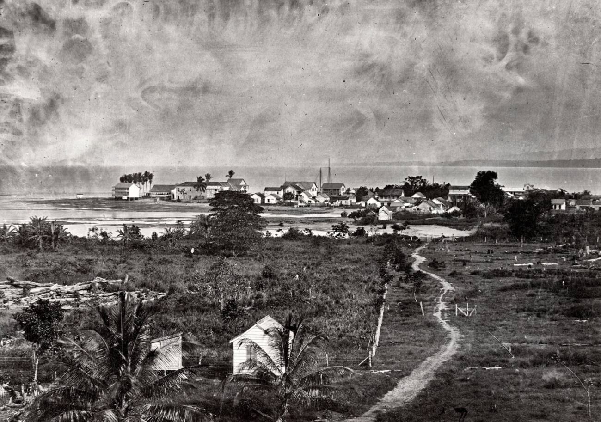
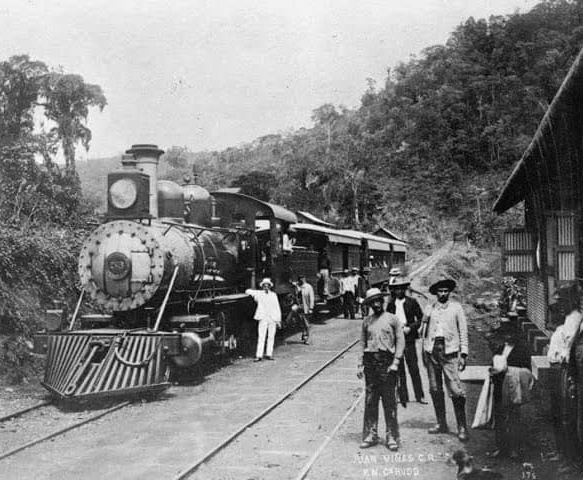
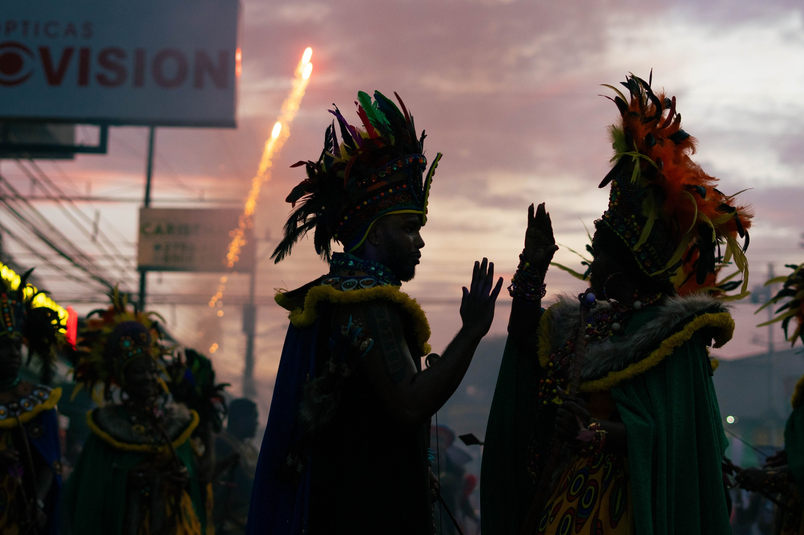
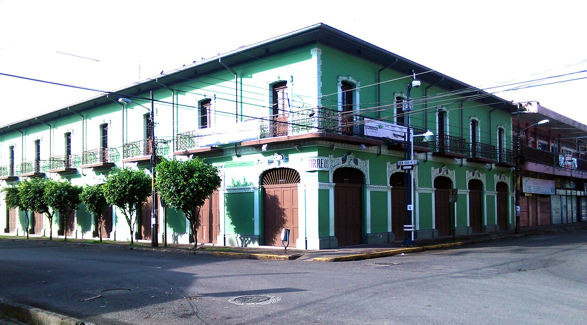
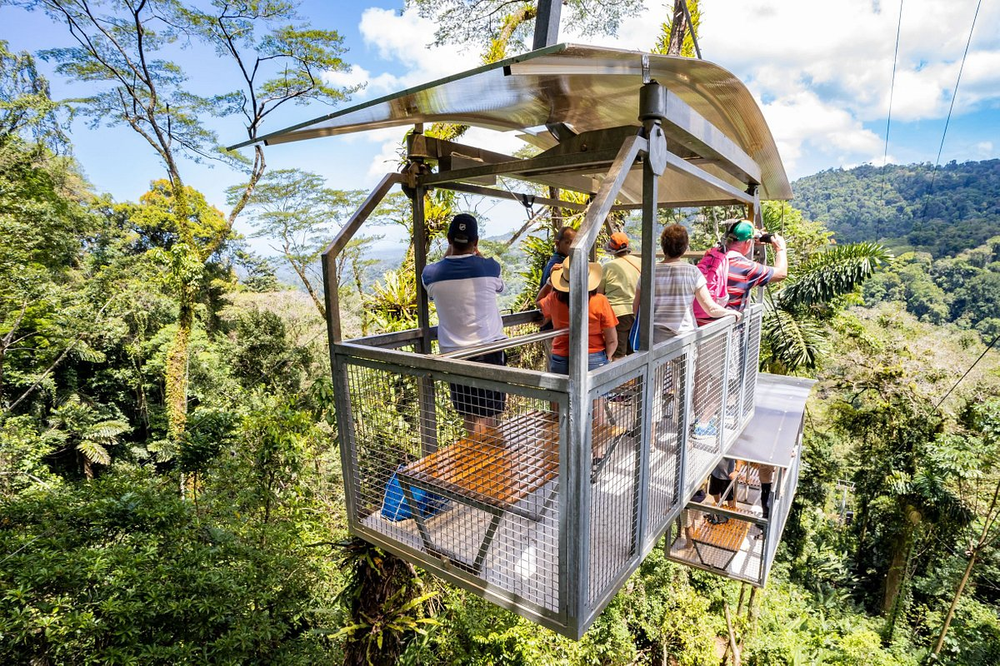
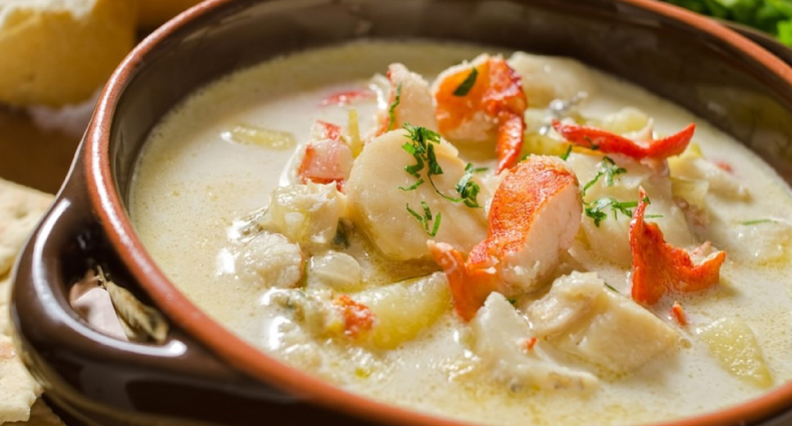
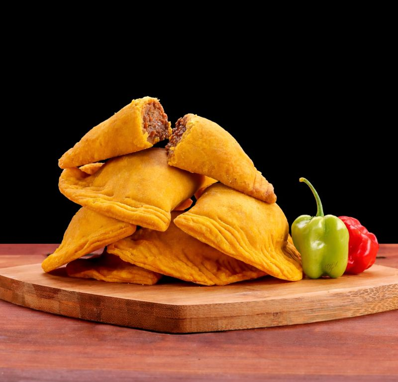
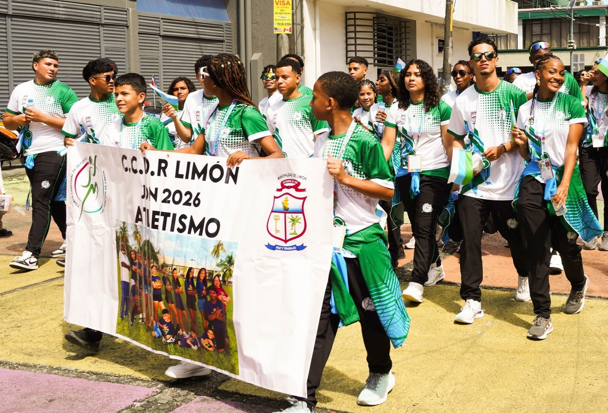
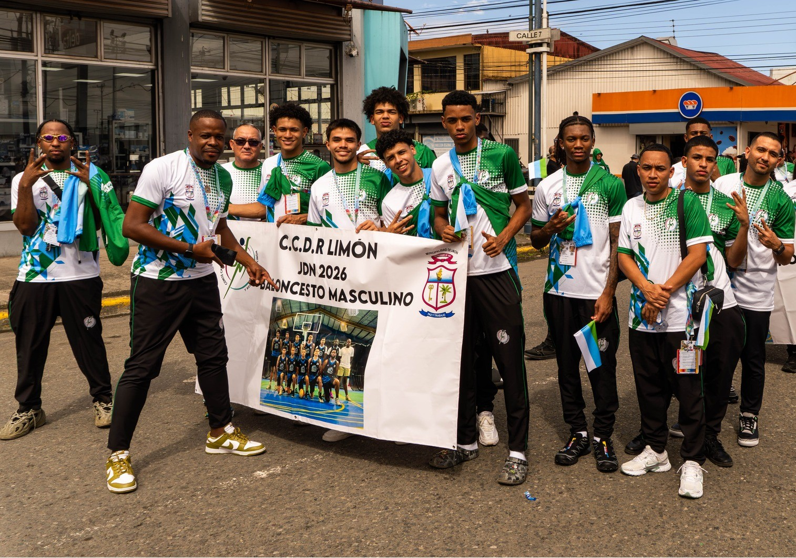
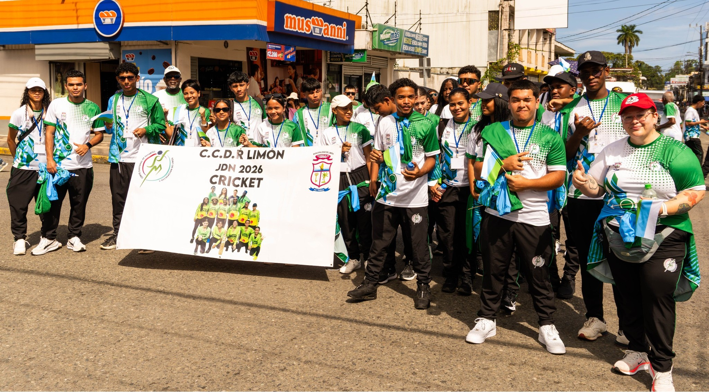

<div align="center">
  
  
  <br /><br />

  <h1>Limón · Realidad y Esencia</h1>

  <p align="center">
    <strong>Un registro documental exhaustivo de la historia, la arquitectura, la cultura y la biodiversidad de la provincia caribeña.</strong>
  </p>

  <p align="center">
    
    
    
    
  </p>
</div>

---

### 📖 Perfil del Proyecto

**Limón: Realidad y Esencia** es una plataforma digital dedicada a retratar la provincia de Limón, Costa Rica, en toda su complejidad. Más que una página informativa, es un archivo visual y narrativo que busca desmantelar estereotipos y mostrar la identidad limonense desde adentro: su patrimonio, su lucha histórica, sus sabores ancestrales y su naturaleza indómita.

---

### 🏛️ Historia y Evolución (Cronología)

La página incluye un recorrido histórico detallado que abarca desde los cimientos de la provincia hasta la actualidad, resaltando los hitos que forjaron el espíritu del Caribe.

<table align="center">
  <tr>
    <td width="33%"></td>
    <td width="33%"></td>
    <td width="33%"></td>
  </tr>
  <tr align="center">
    <td><small>✧ Orígenes (1854)</small></td>
    <td><small>✧ Auge Ferroviario (1890)</small></td>
    <td><small>✧ Visión Actual (2025)</small></td>
  </tr>
</table>

---

### 🏢 Arquitectura Patrimonial

Exploración de los edificios icónicos que narran la historia del comercio y la vida social. Estilos que mezclan lo victoriano con lo caribeño, símbolos de una época de oro y transformación.

<table align="center">
  <tr>
    <td width="25%"></td>
    <td width="25%"></td>
    <td width="25%"></td>
    <td width="25%"></td>
  </tr>
</table>

---

### 🎭 Cultura, Eventos y Música

El corazón de Limón late al ritmo del calipso y sus tradiciones. Esta sección documenta la vida comunitaria, los trajes típicos y la música que define el alma del Caribe.

<table align="center">
  <tr>
    <td width="25%"></td>
    <td width="25%"></td>
    <td width="25%"></td>
    <td width="25%"></td>
  </tr>
  <tr align="center">
    <td><small>✧ Tradición</small></td>
    <td><small>✧ Comunidad</small></td>
    <td><small>✧ Calipso</small></td>
    <td><small>✧ Identidad</small></td>
  </tr>
</table>

---

### 🌿 Naturaleza y Biodiversidad indómita

Desde los humedales de Tortuguero hasta los arrecifes coralinos. Una sección dedicada a la riqueza natural y el compromiso con la conservación del ecosistema caribeño.

<table align="center">
  <tr>
    <td width="33%"></td>
    <td width="33%"></td>
    <td width="33%"></td>
  </tr>
</table>

---

### 🍲 Gastronomía: Sabor y Herencia

Un recorrido por la cocina de autoría africana que define el paladar limonense. Los sabores del coco, el chile panameño y las raíces ancestrales.

<table align="center">
  <tr>
    <td width="25%"></td>
    <td width="25%"></td>
    <td width="25%"></td>
    <td width="25%"></td>
  </tr>
</table>

---

### 🏅 Deporte y Superación

Limón es cuna de grandes atletas. Esta sección rinde homenaje al talento deportivo que ha puesto el nombre de la provincia en alto en múltiples disciplinas.

<table align="center">
  <tr>
    <td width="33%"></td>
    <td width="33%"></td>
    <td width="33%"></td>
  </tr>
</table>

---

### 🛠️ Stack Tecnológico

Implementado con las herramientas más modernas para una experiencia editorial fluida y rápida:

- **Next.js 15+** | Arquitectura SSR y App Router.
- **TypeScript** | Escalabilidad y seguridad en el código.
- **Tailwind CSS** | Estética minimalista y responsive.
- **Framer Motion** | Animaciones de interfaz premium.
- **Lucide** | Iconografía moderna.
- **Leaflet** | Mapas interactivos de la provincia.

---

### 🚀 Instalación

```bash
# Clonar
git clone https://github.com/kirianL/LandingPuertoLim-n.git

# Instalar dependencias
npm install

# Correr servidor
npm run dev
```

---

<div align="center">
  <p>Limón, Costa Rica</p>
  
</div>
